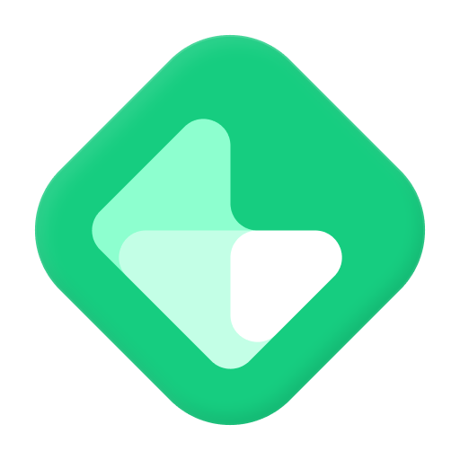
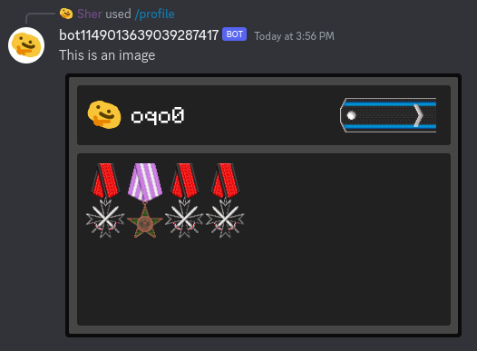
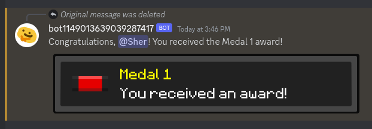

    
     

    <b>GrantBot</b>

    
    
    

---

### 🕵️ About GrantBot

This bot will allow you to simply and quickly add a system of ranks and awards to your Discord server, which you can customize to your needs.

